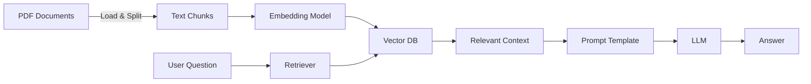

# 🤖 RAG4Bank – AI Chatbot hỗ trợ tra cứu tài liệu ngân hàng

**RAG4Bank** là một ứng dụng Chatbot tích hợp công nghệ **Retrieval-Augmented Generation (RAG)** sử dụng mô hình ngôn ngữ lớn (LLM) và framework **LangChain**, giúp nhân viên ngân hàng dễ dàng tra cứu **quy định nội bộ**, **quy trình làm việc**, và **văn bản pháp luật nhà nước** liên quan đến nghiệp vụ ngân hàng.

> 🚀 Dự án được phát triển hướng tới tối ưu hóa tra cứu tài liệu chuyên sâu, giảm thời gian xử lý, và nâng cao hiệu quả làm việc trong môi trường ngân hàng hiện đại.


## 📚 Mục tiêu ứng dụng

- Cung cấp công cụ **chat thông minh** hỗ trợ nhân viên tra cứu tài liệu nhanh chóng.
- Hỗ trợ truy vấn trên cả tài liệu **nội bộ** và **văn bản pháp luật**.
- Hạn chế rủi ro do **hiểu sai quy định** hoặc áp dụng sai văn bản hướng dẫn.
- Thích hợp triển khai nội bộ hoặc tích hợp vào các cổng thông tin doanh nghiệp.

---

## 🧠 Kiến trúc hệ thống

Dự án sử dụng pipeline RAG với các thành phần chính sau:


---

## 🏗️ Cấu trúc thư mục
```
**RAG4Bank**/
├── data_source/                # Chứa tài liệu nội bộ và pháp luật
│   └── download.py            # Tự động tải tài liệu PDF
├── src/
│   ├── base/
│   │   └── llm_model.py       # Khởi tạo mô hình ngôn ngữ
│   ├── rag/
│   │   ├── file_loader.py     # Load & phân tách tài liệu
│   │   ├── main.py            # Tạo pipeline RAG
│   │   ├── offline_rag.py     # Prompt template & logic offline
│   │   ├── utils.py           # Tách câu trả lời
│   │   └── vectorstore.py     # Xử lý Vector DB
│   └── app.py                 # Khởi tạo FastAPI (REST API)
├── requirements.txt           # Thư viện cần thiết
└── README.md

```

## ⚙️ Các bước cài đặt
1. Clone dự án
```
git clone https://github.com/PTN2004/RAG_Finance.git
cd RAG_Finance
```
2. Cài đặt thư viện
```
pip install -r requirements.txt
```

4. Chạy ứng dụng
```
uvicorn src.app:app --host "0.0.0.0" --port 5001 --reload
```

